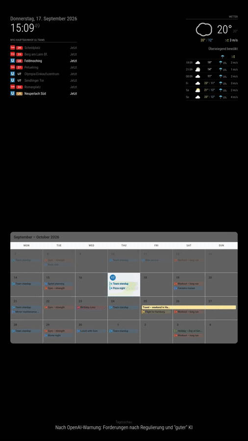
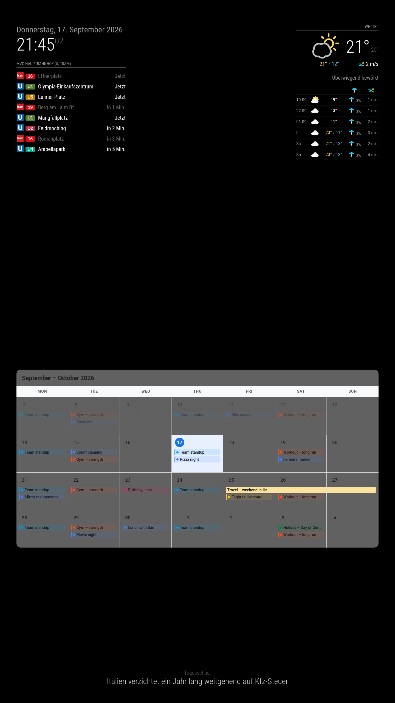
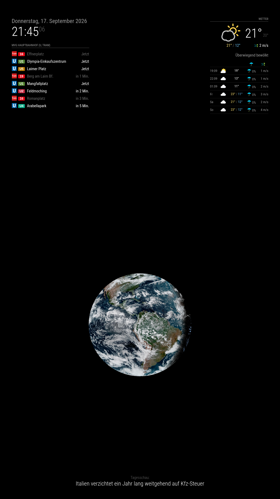
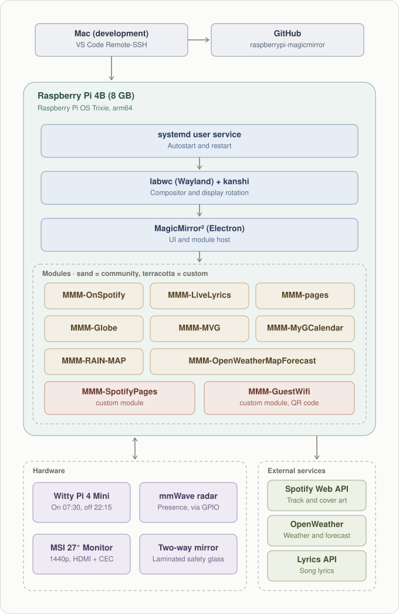

# raspberrypi-magicmirror

A wall-mounted smart mirror built on MagicMirror², running on a Raspberry Pi 4B behind two-way mirror glass.
What makes it more than a dashboard is that the display reacts to state instead of rotating on a timer: it switches to the now-playing page by itself when music starts, and holds a guest Wi-Fi page on request without disturbing the rotation.

<p align="center">  </p> <p align="center"><em>Idle → now playing with live lyrics → guest Wi-Fi</em></p>

---

## The pages
 
| Idle — departures, weather & calendar | Idle — globe | Now playing | Guest Wi-Fi |
|:-------:|:-------:|:-------:|:-------:|
|  |  |  |  |
 

Pages 0 and 1 rotate slowly while nothing is playing. Page 2 appears on its own when playback starts. The guest page is hidden and shown on request.

---

## Architecture
 
<p align="center">
  <p align="center">
  
</p>

</p>
Custom modules live in this repository and are symlinked into the MagicMirror tree, so the
MagicMirror installation itself stays an unmodified upstream checkout. Deployment from the
development machine is an `rsync` of this repository; nothing is edited in place on the Pi.

---
 
## Software stack
 
| Layer | Choice |
|---|---|
| OS | Raspberry Pi OS (Debian 13, arm64) |
| Display server | Wayland with the labwc compositor; `kanshi` for persistent rotation |
| Application | MagicMirror² 2.37 under Electron |
| Process management | systemd **user** service, logging to the journal |
| Display power | HDMI-CEC via `/dev/cec1`; panel wake with `wlr-randr` |
 
**Modules:** `MMM-SpotifyPages` (custom controller), `MMM-GuestWifi` (custom), `MMM-pages`,
`MMM-OnSpotify`, `MMM-LiveLyrics`, `MMM-MVG`, `MMM-MyGCalendar`, `MMM-OpenWeatherMapForecast`,
`MMM-RAIN-MAP`, `MMM-Globe`, `MMM-Remote-Control`, plus the built-in `clock`, `newsfeed` and
`updatenotification`.
 
---
 
## Setup
 
Full installation, from a fresh Raspberry Pi OS image to a running mirror:
**[`docs/setup.md`](docs/setup.md)**
 
> **Credentials never belong in this repository.** `config/secrets.js` is git-ignored;
> `config/secrets.example.js` lists the required keys without values.

 ---
 
## Modules

### Own modules

| Module | Purpose |
|-------|-------|
| `MMM-SpotifyPages`| Invisible controller. Reads the playback state and drives `MMM-pages` — the state machine described above. |
| `MMM-GuestWifi`| Renders a Wi-Fi QR code on a hidden page, so guests can join without being told the password. |


### Third-party modules

| Module | Purpose |
|---|---|
| `MMM-pages`| Splits modules across pages and handles switching, including hidden pages. Its own rotation is disabled — this setup drives it. | 
| [`MMM-MyGCalendar`](https://github.com/johnster000/MMM-MyGCalendar) | Calendar view against a private iCal feed, with keyword-based colour rules and a day modal. |
| [`MMM-OnSpotify`](https://github.com/Fabrizz/MMM-OnSpotify) | Playback state, cover art and device info from the Spotify Web API. Read-only scopes. |
| [`MMM-LiveLyrics`](https://github.com/Fabrizz/MMM-LiveLyrics) | Time-synced lyrics for the current track. |
| [`MMM-MVG`](https://github.com/KoblerS/MMM-MVG) | Live departures for the nearby Munich public transport stop. |
| [`MMM-OpenWeatherMapForecast`](https://github.com/MarcLandis/MMM-OpenWeatherMapForecast) | Current conditions and forecast. |
| [`MMM-RAIN-MAP`](https://github.com/jalibu/MMM-RAIN-MAP) | Animated precipitation radar. |
| [`MMM-Globe`](https://github.com/rkorell/MMM-Globe) | Rotating satellite view of the Earth. |
| [`MMM-Remote-Control`](https://github.com/Jopyth/MMM-Remote-Control) | HTTP API and web UI — used here to trigger the hidden page from outside. |

### Built in

`clock`, `newsfeed`, `alert` and `updatenotification` ship with MagicMirror² and need no separate
repository. Most of those modules are configured as `fixed`, so they stay visible across all pages.

---

## Hidden page

The hidden page with the QR_Code that grants access to a WIFI network can be accessed via:

```bash
KEY=$(grep MM_REMOTE_API_KEY ~/Projects/MagicMirror/.env | cut -d= -f2)
BASE=http://localhost:8080/api/notification

curl -X POST "$BASE/SHOW_HIDDEN_PAGE" \
     -H 'content-type: application/json' \
     -H "Authorization: apiKey $KEY" \
     -d '{"payload": "gast"}'

curl "$BASE/LEAVE_HIDDEN_PAGE?apiKey=$KEY"
```
## Lizenz

MIT — siehe `LICENSE`. Die eingesetzten Module stehen unter ihren eigenen
Lizenzen, nachzulesen in den jeweils verlinkten Repos.
