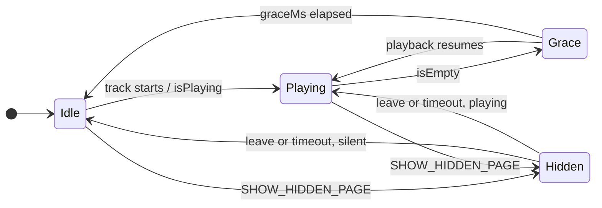

# MMM-SpotifyPages

Invisible controller module that decides which `MMM-pages` page the mirror shows. Source:
[`modules/MMM-SpotifyPages/MMM-SpotifyPages.js`](../modules/MMM-SpotifyPages/MMM-SpotifyPages.js).

`MMM-pages` knows which modules belong to which page, but on its own it can only rotate on a timer.
This module replaces that timer with state: music playing → player page, silence → idle rotation,
guest page open → hands off.

---

## States



| State | Behavior |
|---|---|
| **Idle** | Rotates through `idlePages` every `idleRotationMs`. Resumes where it was interrupted. |
| **Playing** | Shows `spotifyPage`, rotation stopped. |
| **Grace** | Playback stopped; waits `graceMs` before returning to Idle, so a gap between two tracks does not flip the page. |
| **Hidden** | A hidden `MMM-pages` page (the guest Wi-Fi QR code) is open. All timers are stopped and no page switch is sent. After `hiddenPageTimeoutMs` the module sends `LEAVE_HIDDEN_PAGE` itself. On leaving, the playback state is read afresh instead of resuming blindly. |

---

## Why polling, not only notifications

`MMM-OnSpotify` broadcasts `NOW_PLAYING` only on two edges: a new track starts, or the player is
cleared. **Pausing triggers neither** — Spotify clears the player only after a long idle period, so a
notification-only controller would sit on the player page for a long time after the music stopped.

The actual state is available in the frontend: `MMM-OnSpotify` keeps it in `lastStatus`
(`isPlaying`, `isPlayingHidden`, `isEmpty`, `isEmptyHidden`, plus `onReconnecting` / `onError`). The
module reads it every `pollMs`:

| `lastStatus` prefix | Interpretation |
|---|---|
| `isPlaying…` | playing |
| `isEmpty…` | silent |
| anything else | unclear — keep the current state |

`NOW_PLAYING` with `playerIsEmpty: false` remains as a fast path, so the switch to the player page
happens immediately when a track starts rather than on the next poll.

---

## Why switches are throttled

`MMM-pages` hides the old page and shows the new one with `setTimeout`-based animations. A second
`PAGE_SELECT` arriving during that animation can lose the release of the old page's modules: they
stay locked with an `MMM-pages` lock string and remain invisible, although the page index is correct.

This showed up when leaving the player page, where the switch back and the first rotation step
follow each other closely. `goToPage()` therefore never sends two switches closer together than
`minSwitchGapMs`; a switch that would come too early is delayed, and only the most recent request is
kept. Background: [`troubleshooting-spotifypages.md`](troubleshooting-spotifypages.md).

---

## Configuration

| Option | Default | Used here | Meaning |
|---|---|---|---|
| `spotifyPage` | `2` | `2` | Page index shown while playing |
| `idlePages` | `[0, 1]` | `[0, 1]` | Pages rotated while idle |
| `idleRotationMs` | `10000` | `300000` | Rotation interval; `0` stays on the first idle page |
| `graceMs` | `30000` | default | Delay before returning to idle after playback stops |
| `pollMs` | `5000` | default | Status poll interval; `0` disables polling (pause is then not detected) |
| `spotifyModule` | `"MMM-OnSpotify"` | default | Module whose `lastStatus` is read |
| `respectHiddenPages` | `true` | default | Stay out of the way while a hidden page is open |
| `minSwitchGapMs` | `700` | default | Minimum time between two page switches |
| `hiddenPageTimeoutMs` | `120000` | `60000` | Close a hidden page automatically; `0` disables |
| `debug` | `false` | `false` | Log every decision via `Log.info` |

`MMM-pages` must have its own rotation switched off, otherwise its timer overrides this module:

```js
{
	module: "MMM-pages",
	config: {
		timings: { default: 0 },
		// ...
	}
}
```

---

## Implementation notes

- **No `suspend()`/`resume()`.** MagicMirror suspends a module as soon as it is hidden, and `MMM-pages`
  hides everything not assigned to a page. This module has no position and is therefore permanently
  hidden; clearing timers in `suspend()` would stop rotation and polling.
- **`PAGE_SELECT` with an integer.** It replaces the deprecated `PAGE_CHANGED`, and `MMM-pages`
  ignores string indices.
- **Last guard in `emitPage()`.** Even timers that were scheduled before a hidden page opened cannot
  send a switch while it is open.
