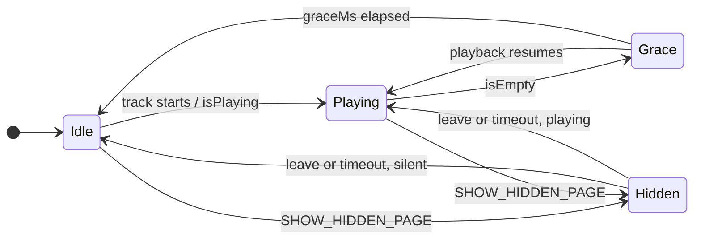

# MMM-SpotifyPages

Invisible controller module that decides which `MMM-pages` page the mirror shows. Source:
[`modules/MMM-SpotifyPages/MMM-SpotifyPages.js`](../modules/MMM-SpotifyPages/MMM-SpotifyPages.js).

`MMM-pages` knows which modules belong to which page, but on its own it can only rotate on a timer.
This module replaces that timer with state: music playing → player page, silence → idle rotation,
guest page open → hands off.

---

## States


```mermaid
stateDiagram-v2
    direction LR
    [*] --> Idle
    Idle --> Playing: track starts / isPlaying
    Playing --> Grace: isEmpty
    Grace --> Playing: playback resumes
    Grace --> Idle: graceMs elapsed
    Idle --> Hidden: SHOW_HIDDEN_PAGE
    Playing --> Hidden: SHOW_HIDDEN_PAGE
    Hidden --> Idle: leave or timeout, silent
    Hidden --> Playing: leave or timeout, playing
```

| State | Behavior |
|---|---|
| **Idle** | Rotates through `idlePages` every `idleRotationMs`. Resumes where it was interrupted. |
| **Playing** | Shows `spotifyPage`, rotation stopped. |
| **Grace** | Playback stopped; waits `graceMs` before returning to Idle, so a gap between two tracks does not flip the page. |
| **Hidden** | A hidden `MMM-pages` page (the guest Wi-Fi QR code) is open. All timers are stopped and no page switch is sent. After `hiddenPageTimeoutMs` the module sends `LEAVE_HIDDEN_PAGE` itself. On leaving, the playback state is read afresh instead of resuming blindly. |

---

## Why polling, not only notifications

`MMM-OnSpotify` broadcasts `NOW_PLAYING` only on two edges: a new track starts, or the player is
cleared. **Pausing triggers neither** — Spotify clears the player only after a long idle period, so a
notification-only controller would sit on the player page for a long time after the music stopped.

The actual state is available in the frontend: `MMM-OnSpotify` keeps it in `lastStatus`
(`isPlaying`, `isPlayingHidden`, `isEmpty`, `isEmptyHidden`, plus `onReconnecting` / `onError`). The
module reads it every `pollMs`:

| `lastStatus` prefix | Interpretation |
|---|---|
| `isPlaying…` | playing |
| `isEmpty…` | silent |
| anything else | unclear — keep the current state |

`NOW_PLAYING` with `playerIsEmpty: false` remains as a fast path, so the switch to the player page
happens immediately when a track starts rather than on the next poll.

---

## Why switches are throttled

`MMM-pages` hides the old page and shows the new one with `setTimeout`-based animations. A second
`PAGE_SELECT` arriving during that animation can lose the release of the old page's modules: they
stay locked with an `MMM-pages` lock string and remain invisible, although the page index is correct.

This showed up when leaving the player page, where the switch back and the first rotation step
follow each other closely. `goToPage()` therefore never sends two switches closer together than
`minSwitchGapMs`; a switch that would come too early is delayed, and only the most recent request is
kept. Background: [`troubleshooting-spotifypages.md`](troubleshooting-spotifypages.md).

---

## Why hidden-page transitions wait for MMM-pages to settle

`MMM-pages` animates every change — `PAGE_SELECT`, `SHOW_HIDDEN_PAGE`, `LEAVE_HIDDEN_PAGE` — the same
way: hide everything that does not belong to the target at once, then **show the target's modules in a
`setTimeout` after `animationTime / 2`** (500 ms by default). That timeout is never cancelled. A second
change inside the window cannot stop the first one from showing its modules afterwards, and the
`show()` with `MMM-pages`' lock string removes the lock the second change had just set.

Seen on 03.10.2026: a guest page opened and closed within a fraction of a second left the QR code
visible behind the calendar. The reverse (close, then reopen quickly) leaves the calendar on top of
the QR code.

The controller therefore tracks `settledAt` — the time after which no `MMM-pages` timer from a known
transition can fire (`animationTime + settleMarginMs` after the last one) — and re-asserts the
intended state once that time has passed:

| Sequence | What would go wrong | What the controller does |
|---|---|---|
| show → hide quickly | pending show of the guest page fires after the hide | the page switch after leaving waits for `settledAt`; that `PAGE_SELECT` hides the guest page again |
| hide → show quickly | pending show of the regular page fires over the guest page | sends `SHOW_HIDDEN_PAGE` once more at `settledAt`, which hides the regular page again |
| any `LEAVE_HIDDEN_PAGE`, even a redundant one | `MMM-pages` animates regardless | counted as a transition |

The cleaner fix belongs in `MMM-pages` itself (keep the timeout handle, `clearTimeout` it at the start of
every transition). The re-assertion stays correct with that fix in place; it then simply does nothing
visible.

---

## Configuration

| Option | Default | Used here | Meaning |
|---|---|---|---|
| `spotifyPage` | `2` | `2` | Page index shown while playing |
| `idlePages` | `[0, 1]` | `[0, 1]` | Pages rotated while idle |
| `idleRotationMs` | `10000` | `300000` | Rotation interval; `0` stays on the first idle page |
| `graceMs` | `30000` | default | Delay before returning to idle after playback stops |
| `pollMs` | `5000` | default | Status poll interval; `0` disables polling (pause is then not detected) |
| `spotifyModule` | `"MMM-OnSpotify"` | default | Module whose `lastStatus` is read |
| `respectHiddenPages` | `true` | default | Stay out of the way while a hidden page is open |
| `minSwitchGapMs` | `700` | default | Minimum time between two page switches |
| `hiddenPageTimeoutMs` | `120000` | `60000` | Close a hidden page automatically; `0` disables |
| `pagesModule` | `"MMM-pages"` | default | Module whose `animationTime` defines a transition |
| `settleMarginMs` | `200` | default | Safety margin added to `animationTime` before re-asserting |
| `debug` | `false` | `false` | Log every decision via `Log.info` |

`MMM-pages` must have its own rotation switched off, otherwise its timer overrides this module:

```js
{
	module: "MMM-pages",
	config: {
		timings: { default: 0 },
		// ...
	}
}
```

---

## Implementation notes

- **No `suspend()`/`resume()`.** MagicMirror suspends a module as soon as it is hidden, and `MMM-pages`
  hides everything not assigned to a page. This module has no position and is therefore permanently
  hidden; clearing timers in `suspend()` would stop rotation and polling.
- **`PAGE_SELECT` with an integer.** It replaces the deprecated `PAGE_CHANGED`, and `MMM-pages`
  ignores string indices.
- **Last guard in `emitPage()`.** Even timers that were scheduled before a hidden page opened cannot
  send a switch while it is open.
- **Own notifications never come back.** MagicMirror does not deliver a notification to its sender.
  When `hiddenPageTimeoutMs` expires, the controller sends `LEAVE_HIDDEN_PAGE` *and* calls
  `leaveHidden()` itself — before 03.10.2026 it only sent the notification and stayed paused, so
  rotation and the Spotify page stopped working after every automatic timeout.

---

## Tests

`tests/js/` runs the real `MMM-SpotifyPages` and the real `MMM-pages` against a minimal stand-in for
MagicMirror's core (notification delivery, `hide()`/`show()` with lock strings) and drives time with
`node:test` mock timers. No dependencies.

```bash
node --test tests/js/*.test.js
# MMM-pages elsewhere:  MMM_PAGES=/path/to/MMM-pages.js node --test tests/js/*.test.js
```

Without an `MMM-pages` installation the tests are skipped.
