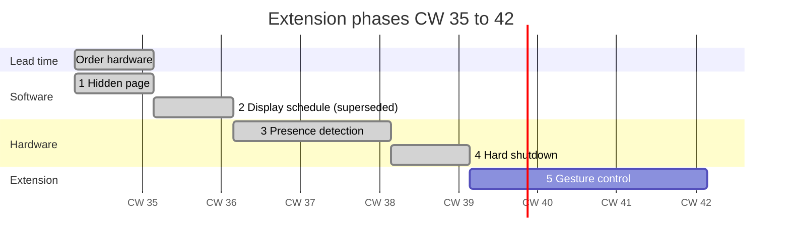

# Roadmap

Extension phases for the mirror after the software base is complete. Status as of CW 38 / 2026.

**Planning basis:** 4 h/day, 5 days a week, so roughly 20 h per week. With seven
working days, the plan compresses by about a third.

| Phase | CW | Effort | Result | Status |
|---|---|---|---|---|
| [1 · Hidden page](#phase-1--hidden-page-on-demand) | 35 | ~6 h | Guest Wi-Fi QR code on demand | ✅ Done |
| [2 · Display schedule](#phase-2--display-schedule) | 36 | ~10 h | Display off at night | ↪ Superseded — see ADR-002 / ADR-005 |
| [3 · Presence detection](#phase-3--presence-detection) | 37–38 | ~25 h | Radar switches the display | ✅ Done |
| [4 · Hard shutdown](#phase-4--hard-shutdown) | 39 | ~14 h | Pi shuts down and wakes up | ✅ Done (ahead of plan) |
| [5 · Gestures](#phase-5--gesture-control) | 40–42 | ~45 h | Modules switched by hand gesture | ⏳ Next |



---

## What changed against the plan

- **Phase 2 wasn't built as planned.** The plan was to switch the HDMI output
  through the compositor (`wlr-randr` / `wlopm`) on systemd timers. Under
  labwc, turning the output off makes the compositor spin up a headless
  replacement output, and re-enabling the real one failed roughly half the
  time ("failed to apply configuration"), leaking a headless output on every
  cycle.
- **Display power moved to HDMI-CEC instead** — it puts the monitor into
  standby while the Pi's own output stays enabled. See
  [ADR-002](adr/002-display-power-cec.md). The time-based part moved into the
  Witty Pi's own schedule (on at 07:30, off at 22:15) — see
  [ADR-005](adr/005-power-management.md). No display timers exist in this
  repo.
- **Phase 3 used wiring variant A** — the sensor's OUT pin goes directly to
  GPIO 27, with no UART in operation. See
  [ADR-004](adr/004-sensor-connection.md). There is no ESP32 node.
- **Phase 4 finished in CW 37**, a week ahead of the original CW 39 plan.
- **The ADRs planned for each phase were written retrospectively, in CW 38**
  (`docs/adr/`).

---

## Order and rationale

The phases build on each other, and not just in terms of timing.

**The hidden page comes first**, because it is the target of every later
phase. Radar and gestures ultimately trigger the same thing: a call that
shows or hides a page. Once that mechanism is in place and tested, the later
phases reduce to the question of who presses the trigger. Built the other
way round, you'd be debugging the sensor and the switching mechanism at the
same time.

**The schedule comes next**, because it needs no hardware and pays off
immediately. It also produces the building block Phase 3 reuses: switching
the display on and off. The radar later only replaces the trigger, not the
mechanism.

**Presence detection comes first among the hardware phases**, because it's
the simpler of the two and forces an architecture decision (sensor on GPIO
or its own node) that also affects Phase 5.

**Hard shutdown comes after that**, because it competes with presence
detection: a powered-off Pi can't detect anyone. Only once Phase 3 is
running do you know whether you actually want it, and for which time
windows.

**Gestures come last**, because they depend on everything below them and
are technically the most demanding.

**The repository and documentation grow with every phase**, not at the end.
Documenting afterward fails because the reasoning has been forgotten by
then.

---

## Phase 1 · Hidden page on demand

**CW 35 · ~6 h · no hardware**
**Status:** done in CW 36

The guest Wi-Fi QR code already lives on a hidden page of MMM-pages and
isn't part of the rotation. This phase makes it callable and, in doing so,
creates the trigger mechanism every later phase uses.

### Tasks

- Verify calling the hidden page over HTTP through MMM-Remote-Control
- Automatic switch-back after a timeout
- Shell script as a convenient entry point
- ADR: why a notification instead of calling `hide()`/`show()` directly

### Artifacts

| Artifact | Location |
|---|---|
| `guest-page.sh` | `scripts/` (done) |
| ADR: hidden page trigger mechanism | [`adr/001-hidden-page-trigger.md`](adr/001-hidden-page-trigger.md) |
| Section in the module docs | `docs/mmm-spotifypages.md` |

### Completion criterion

One command shows the QR code, a second hides it, and after a configured
time it happens automatically.

---

## Phase 2 · Display schedule

**CW 36 · ~10 h · no hardware**
**Status:** superseded

> [!NOTE]
> Superseded — see ["What changed against the plan"](#what-changed-against-the-plan)
> above. Display power now runs over HDMI-CEC (ADR-002), and the schedule
> lives in the Witty Pi (ADR-005). No `display-power.sh` script or systemd
> timers were ever built.

Having a mirror glowing in the hallway at night serves no purpose. This
phase was meant to switch off the HDMI output on a schedule, while the Pi
kept running — modules stay active, data stays current, and there's no boot
process at power-on.

The open question was how to control the display under Wayland/labwc on
Trixie: `wlr-randr --output HDMI-A-1 --off` was the obvious candidate, but
it had to be tested against the running compositor. Server mode without a
graphical session has different preconditions than the later Electron
setup.

### Tasks (as originally planned)

- Verify display control on the target environment
- Script for on/off with status query
- systemd timers for the on and off times
- A manual override path in case the timer gets in the way

### Artifacts

Superseded before implementation — `display-power.sh` and the
`display-on.timer`/`display-off.timer` systemd units were never created.
See [ADR: display control under Wayland](adr/002-display-power-cec.md) and
[ADR: power management](adr/005-power-management.md).

### Completion criterion (not reached — superseded)

The display was meant to switch off at a set time and back on again,
survive a Pi reboot, and show content immediately at power-on.

---

## Phase 3 · Presence detection

**CW 37–38 · ~25 h · hardware required**
**Status:** done in CW 37

The display switches on when someone stands in front of the mirror, and off
again after a hold time. The schedule from Phase 2 still acts as a frame:
it stays dark at night even if someone walks past.

### Technology choice

| Technology | Suitability | Assessment |
|---|---|---|
| **mmWave radar 24 GHz** (HMMD / S3KM1110) | detects presence even without motion, per-zone sensitivity | **selected** |
| PIR (HC-SR501) | reacts only to motion | unsuitable — anyone standing still in front of the mirror disappears |
| Ultrasonic (HC-SR04) | distance measurement, no person-specific signal | unsuitable, prone to interference |
| Camera + person detection | works, but CPU-hungry | overkill for on/off, comes in Phase 5 anyway |
| BLE presence (phone) | detects devices, not people | wrong semantics for a mirror |

The deciding point against PIR: someone shaving or brushing their teeth
moves too little for a PIR sensor. The display would turn off mid-use.
mmWave, by contrast, measures reflections and picks up even breathing
motion.

### Wiring

The Pi sits externally under the mirror; the sensor sits on the mirror.
There's at least a meter between them — which forces an architecture
decision:

| Variant | Effort | Assessment |
|---|---|---|
| **A** Sensor directly on GPIO, `OUT` only | low | sufficient for on/off, use shielded cable |
| **B** Sensor directly on GPIO, UART | low | unreliable over 1 m unshielded at 256,000 baud |
| **C** ESP32 on the mirror, reporting over Wi-Fi | +1 evening, +€6 | clean, a second sensor node, fits the distributed architecture |

Variant A is the fast path to a result, C the better foundation for future
expansion. The decision belongs in an ADR, not made in passing. Variant A
is the one that was actually built — see
[ADR-004](adr/004-sensor-connection.md).

### Chosen sensor

**Waveshare HMMD mmWave sensor** (S3KM1110), 24 GHz FMCW, sourced from
BerryBase.

Compared to the popular LD2410C, it offers two advantages that matter for a
mirror: sensitivity can be configured separately per distance zone — the
near zone in front of the mirror can be set sensitive, while more distant
zones are damped so that every pass through the hallway doesn't trigger it.
And Waveshare ships example code for the Raspberry Pi.

Range up to 8.5 m for moving people, limitable over UART. Module size
20 × 20 mm.

### Pin assignment on the Raspberry Pi

> **Warning: 3.3 V, not 5 V.** The HMMD runs entirely on 3.3 V. Powering it
> from pin 2 (5 V) destroys the module.

| Sensor | Pi pin | GPIO | Function |
|---|---|---|---|
| VCC | 17 | — | **3.3 V** |
| GND | 9 | — | Ground |
| TX | 10 | GPIO 15 (RXD) | not connected in operation — sensor data to the Pi |
| RX | — | ~~GPIO 14 (TXD)~~ | **do not connect**, see below |
| OUT (OT2) | 13 | GPIO 27 | Digital, presence high/low |

Since both sides run 3.3 V logic, no level shifter is needed.

### Why TX/RX stay unconnected in operation

The Witty Pi from Phase 4 doesn't use GPIO 14 (TXD) itself, but
**monitors its voltage**: TXD is expected to be HIGH while the system is
running and go LOW after shutdown. That's how the board knows when it's
safe to cut power. Per the manual, connected devices must not interfere
with this behavior — otherwise the Pi stays powered indefinitely.

In operation, neither UART line ends up wired at all: the sensor's TX and
RX lines stay disconnected, and only the digital OUT pin is used.

**Consequence:** the sensor can't be configured from the Pi. Sensitivity
zones and range are set once, via a USB-TTL adapter (FT232) on the
development machine. These are one-time settings, not something needed
during normal operation — so the loss is easy to live with.

### GPIO assignment overview

| GPIO | Used by | Purpose |
|---|---|---|
| 2 (SDA1) | Witty Pi | I²C to the MCU |
| 3 (SCL1) | Witty Pi | I²C to the MCU |
| 4 | Witty Pi | button / shutdown signal |
| 14 (TXD) | Witty Pi (monitoring only) | detects system-off |
| 15 (RXD) | free | radar UART not used in operation |
| 17 | Witty Pi | SYS_UP signal |
| 27 | **Radar** | presence, digital |

No overlap. GPIO 27 was deliberately chosen over GPIO 17 — the latter is
used by the Witty Pi.

### Preconditions in raspi-config

These three settings must be correct before mounting, or the Pi won't
start up reliably with the Witty Pi attached:

| Setting | Value | Reason |
|---|---|---|
| **1-Wire** | **disabled** | occupies GPIO 4 by default — with 1-Wire active, the Pi shuts back down right after every boot, with no chance to log in |
| **Serial port, hardware** | **enabled** | without a defined idle state on TXD, the Witty Pi cuts power by mistake |
| **Serial port, login shell** | **disabled** | otherwise the console occupies the line the sensor uses |
| **I²C** | **enabled** | communication with the Witty Pi |

For a stable UART on GPIO 14/15, additionally add this to
`/boot/firmware/config.txt`:

```
dtoverlay=disable-bt
enable_uart=1
```

This puts the PL011 UART, instead of the clock-dependent mini-UART, on
these pins. The cost: no more Bluetooth — irrelevant for the mirror.

### Installation

Two-way mirror glass is metal-coated and dampens radio waves; the LCD
chassis blocks them completely. The sensor therefore has to sit outside
the panel area and outside the coated glass area — a pocket in the bottom
frame rail with one to two millimeters of remaining wood is practical.
Wood and MDF are largely transparent to mmWave.

### Artifacts

| Artifact | Location |
|---|---|
| `presence.py` | `scripts/` |
| `presence.service` | `systemd/` |
| Pin assignment and wiring diagram | `docs/hardware.md` |
| ADR: presence sensor choice | [`adr/003-presence-sensor.md`](adr/003-presence-sensor.md) |
| ADR: sensor connection (GPIO or ESP32) | [`adr/004-sensor-connection.md`](adr/004-sensor-connection.md) |

### Completion criterion

The mirror turns on when someone enters the room, stays on while someone
is standing in front of it — even motionless — and turns off after the
hold time. It stays dark during the night hours from Phase 2.

---

## Phase 4 · Hard shutdown

**CW 39 · ~14 h · hardware required**
**Status:** done in CW 37

Up to this point, the Pi keeps running continuously. This phase actually
shuts it down at defined times and wakes it back up.

### Why hardware is needed for this

A powered-off Raspberry Pi can't switch itself back on. It lacks a
battery-backed clock and a circuit that restores power at the right time.
The Pi 5 has some of this built in; the Pi 4B doesn't.

The established solution is a power-management HAT with an RTC. It sits on
the GPIO header, disconnects the Pi from power entirely when needed, and
powers it back up on a schedule.

**Chosen: Witty Pi 4 Mini** (UUGear). RTC with ±2 ppm accuracy, a
supercapacitor good for roughly 17 hours of backup time without power, and
an e-latching button for a clean shutdown. The full Witty Pi 4 differs only
by a DC/DC converter for input voltages up to 30 V and a coin cell instead
of the capacitor — neither is needed when powering from a fixed 5 V supply.

A 2×20 stacking header is **not included** and absolutely necessary:
without it, the board sits flush on the GPIO header and blocks the pins
needed for the radar sensor. The same goes for longer standoffs and
screws — only 4 mm spacers and M2.5×10 screws are included, which are too
short once a stacking header is added.

### Settings that must not be left at default

| Setting | Default | For the mirror | Why |
|---|---|---|---|
| Default state when powered | OFF | **ON** | otherwise the mirror stays dark after a power outage until someone presses the button |

This setting is in `wittyPi.sh` under item 11 (*View/change other
settings*).

### Wiring

The power supply now goes into the **Witty Pi's USB-C port**, not the Pi
anymore. Only that way can the board cut power. Output is rated at up to
2.5 A — that's the limiting figure, not the power supply's 3 A. It's
enough for a Pi 4B plus webcam.

### Tension with presence detection

A powered-off Pi detects no one. The radar can't wake it either, as long
as it isn't wired to the HAT's trigger input. That leads to a division of
labor:

| Time window | Mechanism |
|---|---|
| Daytime | Pi runs, presence detection controls the display |
| Night | Pi is off, the HAT wakes it in the morning |
| Extended absence | manually triggered shutdown |

Boot takes about 30 seconds. So the wake time should be set before the
first expected use, not after.

### Things to watch out for

- Pins in use: GPIO 2, 3, 4 and 17, plus monitoring of GPIO 14 (TXD). No
  conflict with the radar's pin assignment from Phase 3 — see the overview
  there.
- The software is developed and tested against Raspberry Pi OS. Trixie is
  new, so test the installation **immediately after delivery**, not in
  CW 39:

  ```bash
  wget https://www.uugear.com/repo/WittyPi4/install.sh
  sudo sh install.sh
  ```
- There has to be a way back: if the HAT's schedule shuts the Pi down at
  the wrong time, you need a way to bring it back up without disassembly.
  Most HATs have a button for that.
- The Pi sits externally, so the HAT stays accessible. That's one more
  argument for the external setup.

### Artifacts

| Artifact | Location |
|---|---|
| HAT weekly schedule template | `config/mirror.wpi.example` |
| Pin assignment (updated) | `docs/hardware.md` |
| ADR: power management | [`adr/005-power-management.md`](adr/005-power-management.md) |
| Witty Pi recovery steps | `docs/setup.md`, section 14 |

### Completion criterion

The Pi shuts itself down in the evening, is fully powered off, and is up
and ready again before the first use in the morning. A button brings it
back at any time.

---

## Phase 5 · Gesture control

**CW 40–42 · ~45 h · camera required**
**Status:** next — starts CW 40

Hand signals in front of the mirror show and hide modules — the guest QR
code from Phase 1 is the first use case.

This phase is the bridge to the sister project
[`pi-edge-ai`](https://github.com/bikenthusiast/pi-edge-ai): inference
on-device, result sent to the mirror over HTTP.

### Tasks

- Mount the camera on the mirror, work out the cable run to the external Pi
- MediaPipe hand detection under the uv-managed Python environment
- Limit gesture classification to two or three distinguishable signs
- Debouncing: a gesture must not fire per frame, but once per episode
- Hook into MMM-Remote-Control via the Phase 1 trigger
- Load measurement: MediaPipe and Electron share four cores

### Open question on compute

The Pi 4B has no NPU. Whether inference and full-screen rendering can run
at the same time will only be clear from measurement. If not, check in
this order:

1. Lower frame rate and resolution — costs nothing
2. Coral USB Accelerator on the existing Pi — about €60
3. Pi 5 with AI HAT+ — significantly more expensive, but headroom for
   local models

Measure first, then buy.

### Artifacts

| Artifact | Location |
|---|---|
| `gesture.py` with debouncer | `scripts/` |
| Benchmark results | `docs/benchmarks.md` |
| ADR: gesture selection and debouncing | `adr/007-gesture-recognition.md` (planned) |
| Camera mount | `docs/hardware.md` |

### Completion criterion

One defined gesture shows the guest QR code, a second hides it. False
triggers during everyday use are rare enough not to be annoying, and the
mirror stays responsive.

---

## In parallel: frame build

The physical build runs independently of the software phases, but two-way
mirror glass and the panel have long lead times. Orders should therefore
go out early.

Two dependencies run in both directions:

- Phase 3 determines where in the frame the sensor pocket sits — the frame
  shouldn't be permanently closed up before that
- Phase 5 determines the camera position

Build details in [`hardware.md`](hardware.md).

---

## Risks

| Risk | Impact | Mitigation | Status |
|---|---|---|---|
| ~~Delivery times~~ | blocks Phase 3 and 4 entirely | order in CW 35, ahead of need | Resolved |
| ~~Display control under Wayland gets stuck~~ | Phase 2 delayed | verify early, VNC as fallback | Resolved — moved to HDMI-CEC, see ADR-002 |
| ~~Pin conflict: HAT vs. radar~~ | — | **resolved**: no overlap, TXD stays unwired | Resolved |
| ~~Witty Pi software on Trixie~~ | Phase 4 blocked | test immediately after delivery, not only in CW 39 | Resolved |
| 1-Wire active on GPIO 4 | Pi shuts down after every boot | disable in raspi-config before mounting | Verified off |
| CPU not enough for gestures | Phase 5 stalls | lower frame rate, then accelerator | Open |
| Radar dampened through two-way mirror glass | sensor detects nothing | sensor pocket in the bottom frame rail — verify at installation | Open |
