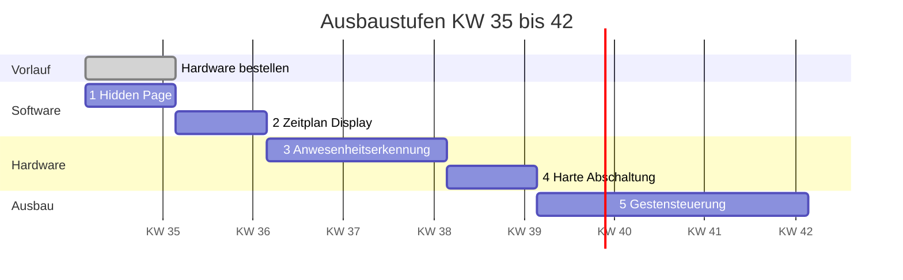

# Roadmap

Ausbaustufen des Spiegels nach Abschluss der Softwarebasis. Stand: KW 35 / 2026.

**Planungsgrundlage:** 4 h/Tag an 5 Tagen, also rund 20 h pro Woche. Bei sieben
Arbeitstagen komprimiert sich der Plan um etwa ein Drittel.

| Phase | KW | Aufwand | Ergebnis |
|---|---|---|---|
| [1 · Hidden Page](#phase-1--hidden-page-auf-zuruf) | 35 | ~6 h | Gast-QR-Code auf Abruf |
| [2 · Zeitplan](#phase-2--display-nach-zeitplan) | 36 | ~10 h | Display nachts aus |
| [3 · Anwesenheit](#phase-3--anwesenheitserkennung) | 37–38 | ~25 h | Radar schaltet das Display |
| [4 · Abschaltung](#phase-4--harte-abschaltung) | 39 | ~14 h | Pi fährt herunter und wacht auf |
| [5 · Gesten](#phase-5--gestensteuerung) | 40–42 | ~45 h | Module per Handzeichen schalten |



---

## Reihenfolge und ihre Begründung

Die Phasen bauen aufeinander auf, und zwar nicht nur zeitlich.

**Die Hidden Page steht zuerst**, weil sie das Ziel aller späteren Phasen ist.
Radar und Geste lösen am Ende dasselbe aus: einen Aufruf, der eine Seite ein-
oder ausblendet. Steht dieser Mechanismus und ist er getestet, reduzieren sich
die späteren Phasen auf die Frage, wer den Auslöser drückt. Umgekehrt gebaut
debuggt man Sensor und Schaltmechanik gleichzeitig.

**Der Zeitplan folgt**, weil er ohne Hardware auskommt und sofort Nutzen bringt.
Dabei entsteht der Baustein, den Phase 3 wiederverwendet: das Ein- und
Ausschalten des Displays. Das Radar ersetzt später nur den Auslöser, nicht die
Mechanik.

**Anwesenheitserkennung als erste Hardware**, weil sie die einfachere von
beiden ist und eine Architekturentscheidung erzwingt (Sensor am GPIO oder eigener
Knoten), die auch Phase 5 betrifft.

**Die harte Abschaltung danach**, weil sie mit der Anwesenheitserkennung in
Konkurrenz steht: Ein ausgeschalteter Pi kann niemanden erkennen. Erst wenn
Phase 3 läuft, weißt du, ob du sie überhaupt willst und für welche Zeitfenster.

**Gesten zuletzt**, weil sie alles darunter voraussetzen und technisch am
anspruchsvollsten sind.

**Repository und Dokumentation wachsen in jeder Phase mit**, nicht am Ende.
Nachträglich dokumentieren scheitert daran, dass die Begründungen vergessen sind.

---

## Phase 1 · Hidden Page auf Zuruf

**KW 35 · ~6 h · keine Hardware**

Der Gast-WLAN-QR-Code liegt bereits auf einer versteckten Seite von MMM-pages und
ist nicht Teil der Rotation. Diese Phase macht ihn aufrufbar und schafft damit
den Auslösemechanismus, den alle folgenden Phasen benutzen.

### Aufgaben

- Aufruf der versteckten Seite per HTTP über MMM-Remote-Control verifizieren
- Automatisches Zurückschalten nach einer Zeitspanne
- Shell-Skript als bequemer Einstiegspunkt
- ADR: warum Notification statt direktem `hide()`/`show()`

### Artefakte

| Artefakt | Ort |
|---|---|
| `guest-wifi.sh` | `scripts/` |
| ADR Auslösemechanismus | `docs/adr/003-hidden-page-trigger.md` |
| Abschnitt in der Modul-Doku | `docs/mmm-spotifypages.md` |

### Abschlusskriterium

Ein Befehl blendet den QR-Code ein, ein zweiter blendet ihn aus, und nach einer
konfigurierten Zeit passiert das von selbst.

---

## Phase 2 · Display nach Zeitplan

**KW 36 · ~10 h · keine Hardware**

Nachts einen leuchtenden Spiegel im Flur zu haben ist unnötig. Diese Phase
schaltet den HDMI-Ausgang zeitgesteuert ab. Der Pi läuft weiter — Module bleiben
aktiv, Daten aktuell, kein Bootvorgang beim Einschalten.

Zu klären ist der Weg zur Displaysteuerung unter Wayland/labwc auf Trixie:
`wlr-randr --output HDMI-A-1 --off` ist der naheliegende Kandidat, muss aber
gegen den laufenden Compositor getestet werden. Für den Server-Modus ohne
grafische Session gelten andere Voraussetzungen als für den späteren
Electron-Betrieb.

### Aufgaben

- Displaysteuerung auf der Zielumgebung verifizieren
- Skript für an/aus mit Statusabfrage
- systemd-Timer für Ein- und Ausschaltzeit
- Manueller Übersteuerungsweg, falls der Timer stört

### Artefakte

| Artefakt | Ort |
|---|---|
| `display-power.sh` | `scripts/` |
| `display-on.timer`, `display-off.timer` | `systemd/` |
| ADR Displaysteuerung unter Wayland | `docs/adr/004-display-power.md` |

### Abschlusskriterium

Das Display schaltet zur eingestellten Zeit ab und wieder ein, überlebt einen
Neustart des Pi, und der Spiegel zeigt beim Einschalten sofort Inhalt.

---

## Phase 3 · Anwesenheitserkennung

**KW 37–38 · ~25 h · Hardware erforderlich**

Das Display schaltet ein, wenn jemand vor dem Spiegel steht, und nach einer
Nachlaufzeit wieder ab. Der Zeitplan aus Phase 2 bleibt als Rahmen bestehen:
nachts bleibt es dunkel, auch wenn jemand vorbeigeht.

### Technologiewahl

| Technologie | Eignung | Bewertung |
|---|---|---|
| **mmWave-Radar 24 GHz** (HMMD / S3KM1110) | erkennt auch reglose Anwesenheit, Empfindlichkeit pro Zone | **gewählt** |
| PIR (HC-SR501) | reagiert nur auf Bewegung | ungeeignet — wer still vor dem Spiegel steht, verschwindet |
| Ultraschall (HC-SR04) | Abstandsmessung, kein Personenbezug | ungeeignet, störanfällig |
| Kamera + Personenerkennung | funktioniert, aber CPU-hungrig | Overkill für an/aus, kommt in Phase 5 ohnehin |
| BLE-Präsenz (Handy) | erkennt Geräte, nicht Personen | falsche Semantik für einen Spiegel |

Der entscheidende Punkt gegen PIR: Ein Mensch, der sich rasiert oder die Zähne
putzt, bewegt sich für einen PIR-Sensor zu wenig. Das Display ginge mitten im
Gebrauch aus. mmWave misst dagegen Reflexionen und erkennt selbst Atembewegung.

### Verkabelung

Der Pi steht extern unter dem Spiegel, der Sensor sitzt am Spiegel. Dazwischen
liegt mindestens ein Meter — daraus folgt eine Architekturentscheidung:

| Variante | Aufwand | Bewertung |
|---|---|---|
| **A** Sensor direkt am GPIO, nur `OUT` | gering | ausreichend für an/aus, geschirmtes Kabel verwenden |
| **B** Sensor direkt am GPIO, UART | gering | über 1 m ungeschirmt wackelig bei 256000 Baud |
| **C** ESP32 am Spiegel, Meldung per WLAN | +1 Abend, +6 € | sauber, zweiter Sensorknoten, passt zur verteilten Architektur |

Variante A ist der schnelle Weg zum Ergebnis, C die bessere Grundlage für den
Ausbau. Die Entscheidung gehört in ein ADR, nicht nebenbei getroffen.

### Gewählter Sensor

**Waveshare HMMD mmWave Sensor** (S3KM1110), 24 GHz FMCW, bezogen über BerryBase.

Gegenüber dem verbreiteten LD2410C bietet er zwei Vorteile, die für einen
Spiegel zählen: Die Empfindlichkeit lässt sich pro Entfernungsbereich einzeln
konfigurieren — der Nahbereich vor dem Spiegel kann empfindlich stehen, während
weiter entfernte Zonen gedämpft werden, damit nicht jeder Durchgang im Flur
auslöst. Und Waveshare liefert Beispielcode für den Raspberry Pi mit.

Reichweite bis 8,5 m für bewegte Personen, über UART begrenzbar. Modulgröße
20 × 20 mm.

### Pinbelegung am Raspberry Pi

> **Achtung: 3,3 V, nicht 5 V.** Der HMMD arbeitet vollständig mit 3,3 V.
> Versorgung über Pin 2 (5 V) zerstört das Modul.

| Sensor | Pi-Pin | GPIO | Funktion |
|---|---|---|---|
| VCC | 1 oder 17 | — | **3,3 V** |
| GND | 6, 9 oder 14 | — | Masse |
| TX | 10 | GPIO 15 (RXD) | Sensordaten zum Pi |
| RX | — | ~~GPIO 14 (TXD)~~ | **nicht verbinden**, siehe unten |
| OUT | 13 | GPIO 27 | Digital, Präsenz high/low |

Da beide Seiten mit 3,3-V-Logik arbeiten, ist kein Pegelwandler nötig.

### Warum TXD unbeschaltet bleibt

Der Witty Pi aus Phase 4 nutzt GPIO 14 (TXD) nicht selbst, **überwacht aber
dessen Spannung**: TXD soll HIGH sein, solange das System läuft, und nach dem
Herunterfahren LOW werden. Daran erkennt das Board, wann es den Strom kappen
darf. Laut Handbuch dürfen angeschlossene Geräte dieses Verhalten nicht
verändern — sonst bleibt der Pi dauerhaft unter Spannung.

Deshalb wird nur die Empfangsrichtung verdrahtet: Der Sensor sendet, der Pi
hört zu.

**Konsequenz:** Der Sensor lässt sich nicht vom Pi aus konfigurieren.
Empfindlichkeitszonen und Reichweite werden einmalig über einen USB-TTL-Adapter
am Entwicklungsrechner eingestellt. Das sind Einmaleinstellungen, kein
laufender Betrieb — der Verlust ist verschmerzbar.

### GPIO-Belegung im Überblick

| GPIO | Verwendet von | Zweck |
|---|---|---|
| 2 (SDA1) | Witty Pi | I²C zum MCU |
| 3 (SCL1) | Witty Pi | I²C zum MCU |
| 4 | Witty Pi | Taster / Shutdown-Signal |
| 14 (TXD) | Witty Pi (nur Überwachung) | erkennt System-Aus |
| 15 (RXD) | **Radar** | Sensordaten |
| 17 | Witty Pi | SYS_UP-Signal |
| 27 | **Radar** | Präsenz digital |

Keine Überschneidung. GPIO 27 wurde bewusst statt GPIO 17 gewählt — letzterer
ist vom Witty Pi belegt.

### Vorbedingungen in raspi-config

Diese drei Einstellungen müssen vor der Montage stimmen, sonst startet der Pi
mit aufgestecktem Witty Pi nicht zuverlässig:

| Einstellung | Wert | Begründung |
|---|---|---|
| **1-Wire** | **deaktiviert** | belegt standardmäßig GPIO 4 — bei aktivem 1-Wire fährt der Pi nach jedem Boot sofort wieder herunter, ohne dass ein Login möglich ist |
| **Serieller Port, Hardware** | **aktiviert** | ohne definierten Ruhezustand auf TXD kappt Witty Pi den Strom versehentlich |
| **Serieller Port, Login-Shell** | **deaktiviert** | sonst belegt die Konsole die Leitung, die der Sensor nutzt |
| **I²C** | **aktiviert** | Kommunikation mit dem Witty Pi |

Für einen stabilen UART auf GPIO 14/15 zusätzlich in `/boot/firmware/config.txt`:

```
dtoverlay=disable-bt
enable_uart=1
```

Damit liegt der PL011-UART statt des taktabhängigen Mini-UART auf diesen Pins.
Preis: kein Bluetooth mehr — für den Spiegel unerheblich.

### Einbau

Spionglas ist metallbedampft und dämpft Funkwellen, das LCD-Chassis sperrt
vollständig. Der Sensor muss deshalb außerhalb der Panelfläche und außerhalb der
bedampften Glasfläche sitzen — praktikabel ist eine Tasche in der unteren
Rahmenleiste mit ein bis zwei Millimeter Restholz. Holz und MDF sind für mmWave
weitgehend transparent.

### Artefakte

| Artefakt | Ort |
|---|---|
| `presence.py` oder ESP32-Firmware | `scripts/` bzw. `firmware/` |
| Pinbelegung und Schaltplan | `docs/hardware.md` |
| ADR Sensorwahl | `docs/adr/005-praesenzsensor.md` |
| ADR Anbindung (GPIO oder ESP32) | `docs/adr/006-sensoranbindung.md` |
| systemd-Unit für den Sensordienst | `systemd/` |

### Abschlusskriterium

Der Spiegel geht an, wenn jemand den Raum betritt, bleibt an, solange jemand
davorsteht — auch reglos —, und geht nach der Nachlaufzeit aus. Innerhalb der
Nachtzeiten aus Phase 2 bleibt er dunkel.

---

## Phase 4 · Harte Abschaltung

**KW 39 · ~14 h · Hardware erforderlich**

Bis hierher läuft der Pi durch. Diese Phase fährt ihn zu definierten Zeiten
wirklich herunter und weckt ihn wieder.

### Warum dafür Hardware nötig ist

Ein heruntergefahrener Raspberry Pi kann sich nicht selbst einschalten. Ihm
fehlen eine batteriegepufferte Uhr und eine Schaltung, die die Stromversorgung
zum richtigen Zeitpunkt wieder herstellt. Der Pi 5 bringt Ansätze davon mit, der
Pi 4B nicht.

Die etablierte Lösung ist ein Power-Management-HAT mit RTC. Er sitzt auf dem
GPIO-Header, trennt den Pi bei Bedarf vollständig vom Strom und fährt ihn nach
Zeitplan wieder hoch.

**Gewählt: Witty Pi 4 Mini** (UUGear). RTC mit ±2 ppm Genauigkeit, Superkondensator
für rund 17 Stunden Gangreserve ohne Strom, e-Latching-Taster für sauberes
Herunterfahren. Die volle Variante Witty Pi 4 unterscheidet sich nur durch einen
DC/DC-Wandler für Eingangsspannungen bis 30 V und eine Knopfzelle statt des
Kondensators — beides wird bei Versorgung aus einem festen 5-V-Netzteil nicht
gebraucht.

Ein 2×20-Stacking-Header ist **nicht im Lieferumfang** und zwingend nötig: Ohne
ihn sitzt das Board flach auf dem GPIO-Header und blockiert die Pins für den
Radarsensor. Ebenso längere Abstandshülsen und Schrauben — beigelegt sind nur
4-mm-Spacer und M2.5×10-Schrauben, die mit Stacking-Header nicht mehr reichen.

### Einstellungen, die nicht auf Standard bleiben dürfen

| Einstellung | Standard | Für den Spiegel | Warum |
|---|---|---|---|
| Default state when powered | OFF | **ON** | sonst bleibt der Spiegel nach einem Stromausfall dunkel, bis jemand den Taster drückt |

Die Einstellung findet sich in `wittyPi.sh` unter Punkt 11
(*View/change other settings*).

### Verkabelung

Das Netzteil geht künftig in den **USB-C-Anschluss des Witty Pi**, nicht mehr in
den Pi. Nur so kann das Board die Stromzufuhr kappen. Die Ausgangsleistung ist
mit bis zu 2,5 A angegeben — das ist die Grenze, nicht die 3 A des Netzteils.
Für Pi 4B plus Webcam reicht es.

### Spannungsfeld zur Anwesenheitserkennung

Ein ausgeschalteter Pi erkennt niemanden. Das Radar kann ihn auch nicht wecken,
solange es nicht am Trigger-Eingang des HAT hängt. Daraus folgt eine
Arbeitsteilung:

| Zeitfenster | Mechanismus |
|---|---|
| Tagsüber | Pi läuft, Anwesenheitserkennung steuert das Display |
| Nachts | Pi ist aus, HAT weckt ihn morgens |
| Längere Abwesenheit | manuell ausgelöste Abschaltung |

Der Bootvorgang dauert rund 30 Sekunden. Deshalb sollte die Weckzeit vor der
ersten erwarteten Nutzung liegen, nicht danach.

### Zu beachten

- Belegte Pins: GPIO 2, 3, 4 und 17, dazu Überwachung von GPIO 14 (TXD).
  Kein Konflikt mit der Radarbelegung aus Phase 3 — siehe dortige Übersicht.
- Die Software wird gegen Raspberry Pi OS entwickelt und getestet. Trixie ist
  frisch; die Installation deshalb **sofort nach Lieferung** testen, nicht erst
  in KW 39:

  ```bash
  wget https://www.uugear.com/repo/WittyPi4/install.sh
  sudo sh install.sh
  ```
- Ein Rückweg muss vorhanden bleiben: Wenn der Zeitplan des HAT den Pi zur
  falschen Zeit abschaltet, braucht es einen Weg, ihn ohne Ausbau wieder
  hochzubekommen. Die meisten HATs haben dafür einen Taster.
- Der Pi steht extern, der HAT ist also zugänglich. Das ist ein Argument mehr für
  den externen Aufbau.

### Artefakte

| Artefakt | Ort |
|---|---|
| Wochenplan des HAT | `config/` |
| Pinbelegung ergänzt | `docs/hardware.md` |
| ADR harte Abschaltung vs. Display-Aus | `docs/adr/007-power-management.md` |
| Notfallanleitung | `docs/troubleshooting.md` |

### Abschlusskriterium

Der Pi fährt abends selbstständig herunter, ist stromlos, und steht morgens vor
der ersten Nutzung wieder betriebsbereit. Ein Taster holt ihn jederzeit zurück.

---

## Phase 5 · Gestensteuerung

**KW 40–42 · ~45 h · Kamera erforderlich**

Handzeichen vor dem Spiegel blenden Module ein und aus — der Gast-QR-Code aus
Phase 1 ist der erste Anwendungsfall.

Diese Phase ist die Brücke zum Schwesterprojekt
[`pi-edge-ai`](https://github.com/bikenthusiast/pi-edge-ai): Inferenz auf dem
Gerät, Ergebnis per HTTP an den Spiegel.

### Aufgaben

- Kamera am Spiegel montieren, Kabelweg zum externen Pi klären
- MediaPipe-Handerkennung unter der uv-verwalteten Python-Umgebung
- Gestenklassifikation auf zwei bis drei unterscheidbare Zeichen begrenzen
- Debouncing: eine Geste darf nicht pro Frame feuern, sondern einmal pro Episode
- Anbindung an MMM-Remote-Control über den Auslöser aus Phase 1
- Lastmessung: MediaPipe und Electron teilen sich vier Kerne

### Offene Frage zur Rechenleistung

Der Pi 4B hat keine NPU. Ob Inferenz und Vollbild-Rendering gleichzeitig
laufen, zeigt erst die Messung. Falls nicht, in dieser Reihenfolge prüfen:

1. Bildrate und Auflösung senken — kostet nichts
2. Coral USB Accelerator am vorhandenen Pi — rund 60 €
3. Pi 5 mit AI HAT+ — deutlich teurer, dafür Reserve für lokale Modelle

Erst messen, dann kaufen.

### Artefakte

| Artefakt | Ort |
|---|---|
| `gesture.py` mit Debouncer | `scripts/` |
| Benchmark-Ergebnisse | `docs/benchmarks.md` |
| ADR Gestenauswahl und Debouncing | `docs/adr/008-gestenerkennung.md` |
| Kameramontage | `docs/hardware.md` |

### Abschlusskriterium

Eine definierte Geste blendet den Gast-QR-Code ein, eine zweite blendet ihn aus.
Fehlauslösungen im Alltagsbetrieb sind selten genug, um nicht zu stören, und der
Spiegel bleibt flüssig.

---

## Parallel: Rahmenbau

Der physische Aufbau läuft unabhängig von den Softwarephasen, hat aber lange
Lieferzeiten bei Spionglas und Panel. Bestellungen gehören deshalb früh
angestoßen.

Zwei Abhängigkeiten in beide Richtungen:

- Phase 3 legt fest, wo im Rahmen die Sensortasche sitzt — der Rahmen sollte
  nicht vorher endgültig verschlossen werden
- Phase 5 legt die Kameraposition fest

Details zum Aufbau in [`hardware.md`](hardware.md).

---

## Risiken

| Risiko | Auswirkung | Gegenmaßnahme |
|---|---|---|
| Lieferzeiten | blockiert Phase 3 und 4 vollständig | in KW 35 bestellen, vor Bedarf |
| Displaysteuerung unter Wayland klemmt | Phase 2 verzögert sich | früh verifizieren, VNC als Rückfallweg |
| ~~Pin-Konflikt HAT gegen Radar~~ | — | **geklärt**: keine Überschneidung, TXD bleibt unbeschaltet |
| Witty-Pi-Software unter Trixie | Phase 4 blockiert | sofort nach Lieferung testen, nicht erst in KW 39 |
| 1-Wire aktiv auf GPIO 4 | Pi fährt nach jedem Boot herunter | vor Montage in raspi-config deaktivieren |
| CPU reicht für Gesten nicht | Phase 5 stockt | Bildrate senken, dann Beschleuniger |
| Radar durch Spionglas gedämpft | Sensor erkennt nichts | Sensor außerhalb der Glasfläche einbauen |